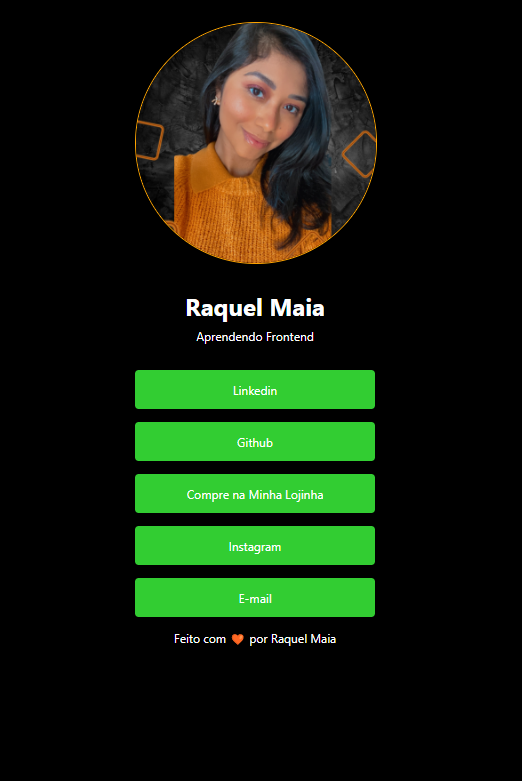

# 💻 Projeto MyLink
Desenvolvi esse projeto incrível durante o curso StepOne, com a incrível Adriana Saty! 🚀

Com ele, você pode reunir todos os seus principais links de redes sociais e contatos em um só lugar, estilo o LinkTree. 🔗

Não perca mais tempo procurando seus links nas redes sociais, agora você pode ter tudo em um único lugar, de fácil acesso para todos! 🌍

O layout é moderno e atrativo, tornando sua página ainda mais profissional e elegante. 🎨

Se você quer ter seus links reunidos em um só lugar, esse é o projeto certo para você! 😎

## Vamos lá!

- Basta clonar o projeto e personalizar com seus links e informações pessoais.

- Você vai se surpreender com o quanto é fácil e divertido ter tudo reunido em um só lugar! 🚀

## Veja o projeto finalizado:

